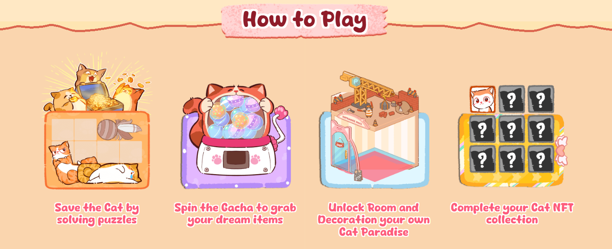
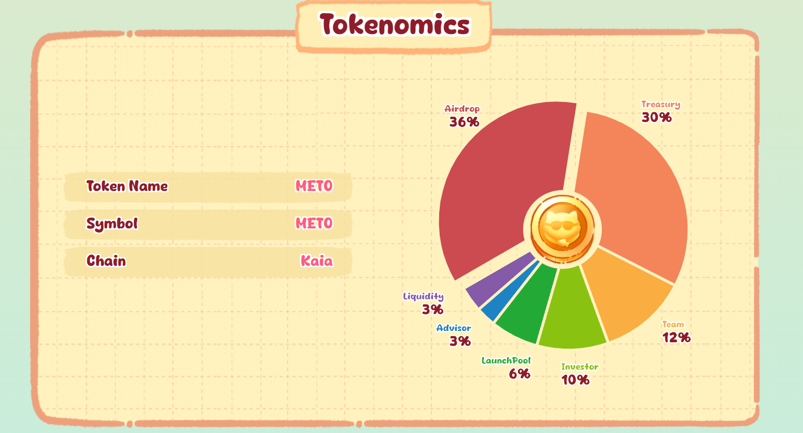

# Meowtopia 自动化机器人


欢迎来到 Meowtopia！进入一个充满魔法的世界，可爱的猫咪们正在等待它们的英雄 - 你！拯救稀有猫咪，打造温馨家园，展示你的独特风格。

作为 Kaia Wave 上的先驱项目，Meowtopia 让你可以拯救猫咪、攀登排行榜并领取空投。立即开始你的旅程，打造终极猫咪天堂！


- 官网 https://meowtopia.fun/

## 功能特性

- **自动签到**
- **自动玩拼图游戏**
- **自动抽奖**
- **自动领取挖矿奖励**
- **自动建造装饰**
- **支持多账号**
- **支持使用代理**

## 环境要求

- 已安装 Node.js
- `accounts.txt` 文件包含 Meowtopia 平台地址，获取方法如下：
- 打开 Meowtopia 小程序 [https://t.me/Meowtopia_Kaiabot/](https://t.me/Meowtopia_Kaiabot/myapp?startapp=687123588)

- 在游戏中找到设置/齿轮图标，点击并复制你的 ID


## 安装步骤

1. 克隆仓库：
    ```sh
    git clone https://github.com/0xbaiwan/meow_bot
    cd meow_bot
    ```

2. 安装依赖：
    ```sh
    npm install
    ```

3. 在 `accounts.txt` 文件中输入你的 ID，每行一个用户：
    ```sh
    nano accounts.txt
    ```

4. 可选：使用代理：
- 格式 `http://用户名:密码@IP:端口` 或 `socks5://用户名:密码@IP:端口`
    ```sh
    nano proxy.txt
    ```

5. 运行脚本：
    ```sh
    npm run start
 
    ```
## 更新代码

1. 拉取最新代码：
   ```bash
   git pull origin main
   ```

2. 如果遇到冲突：
   ```bash
   git stash
   git pull origin main
   git stash pop
   ```

## 购买代理（可选）

- 免费静态住宅代理：
   - [WebShare](https://www.webshare.io/?referral_code=gtw7lwqqelgu)
   - [ProxyScrape](https://proxyscrape.com/)
   - [MonoSans](https://github.com/monosans/proxy-list)
- 付费高级静态住宅代理：
   - [922proxy](https://www.922proxy.com/register?inviter_code=d6416857)
   - [Proxy-Cheap](https://app.proxy-cheap.com/r/Pd6sqg)
   - [Infatica](https://dashboard.infatica.io/aff.php?aff=580)
- 付费动态IP代理
   - [IPRoyal](https://iproyal.com/?r=733417)

